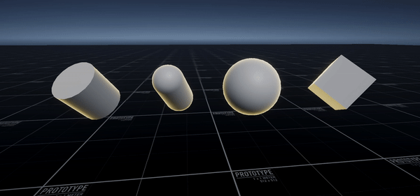
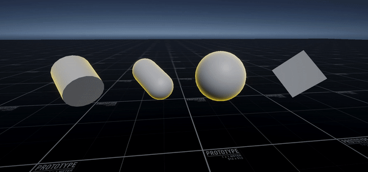
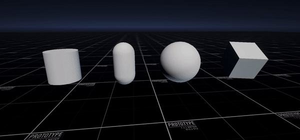
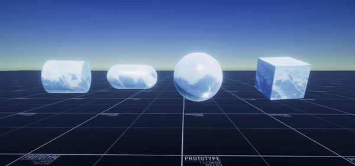
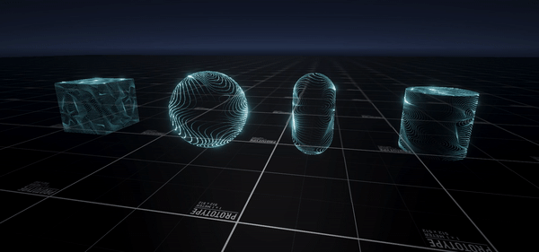
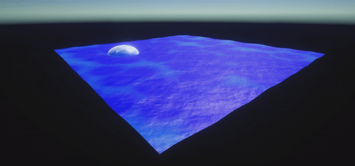

# 0x0D. Unity - ShaderGraph

This project contains a collection of shaders and example materials create for a project at Holberton School. Shaders are free to use in all contexts.

Download the package: [0x0D-unity-shaders](https://drive.google.com/file/d/1msN_Yg3sQ-UTh0kYlFk0dTV8NtIMHAzI/view?usp=sharing)

## Glow

Simple rim glow with parameters to control color, size, and strength.

## Animated Glow

Animated rim glow with parameters for fresnel width, strength, color, etc.

## Disintegrate

Disintegration effect with edge glow.

## Ice

Ice shader with refraction and plugs for multiple textures.

## Hologram

Hologram shader featuring dynamic texture scanning, flicker, and vertex deisplacement.

## Water

Water shader with two layers of wave simulation via vertex displacement and height-dynamic foam.

